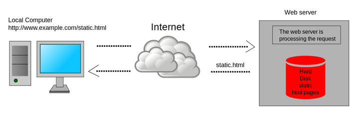

# Static Website Generator

https://www.techiediaries.com/jekyll-hugo-hexo/

[^_^]:
Author: Techiediaries Team, 10 Feb 2018

*****************

## 1 What's Static Website Generation?

Static website generation refers to the process of statically generating a 
website i.e generate the HTML files, for example, in a local machine and then 
upload the website files to a server that serves them to users when they are 
requested. The server doesn't do any server side processing or database 
communication it only sends the plain HTML files once they are requested.



Wikipedia: A static web page is delivered to the user exactly as stored.

In fact the first website in the world wide web was static (the first web page 
went live on August 6, 1991 by Tim Berners-Lee) since servers back then were 
very primitive with no scripting language such as PHP or databases like MySQL. 

## 2 Reasons for Choosing the Static Approach?

Nowadays there is a plethora of server side languages, database management 
systems and content management systems so why do many website owners go static?

There are many reasons such as:
* contents are stored as flat files so no need for a database
* a static website doesn't need dynamic server side processing
* static websites are super fast than dynamic websites since they require 
no server side processing or database access
* static websites are more secure than any dynamic website since there are 
less security holes to exploit
* super scaling when used with CDN
* caching static files is more effecive than caching dynamic pages

## 3 Jekyll vs Hugo vs Hexo

In this section we'll introduce three popular static site generators: 
Jekyll, Hugo and Hexo, see their pros and cons and we'll also compare them 
according to different criteria such as:

* speed,
* community and popularity,
* templating system and themes,
* workflow and easiness of use,
* markdown and multiple formats support,
* advanced content management,
* assets handling,
* plugins support and extensibility

### 3.1 Jekyll

#### 3.1.1 An introduction to Jekyll

[Jekyll](https://jekyllrb.com/) 
is a blog-aware static site generator designed for building personal, 
portfolio and orgnanization websites but also fully fledged blogs.

Jekyll is built in Ruby language by Github and you can use Github Pages 
for free to host your static website and easily link it with your custom top 
domain name using a *CNAME* file.

#### 3.1.2 Pros and Cons of Jekyll

Just like any tool, Jekyll has its own set of pros and cons. Let's cover 
the most important ones:

For the pros:

* it's free and open source
* you can build themes as gems and distribute them through RubyGems
* easy and simple to use
* you can easily migrate your content from popular platforms (e.g. WordPress) 
thanks to [Jekyll importers](https://import.jekyllrb.com/docs/home/)
* great Github Pages support
* comes with default and decent minimal theme out of the box

Jekyll has also a few cons such as:

* as you website content grows, the build process becomes significantly 
slower (this is the major weakness of Jekyll)
* the incremental build is still experimental
* no built-in post pagination as of Jekyll 3
* it doesn't support using variables in titles or YAML
* many plugins becomes outdated
* gem dependencies may introduce incompatibilities
* Github Pages supports Jekyll out of the box but only a set of 
[Github-safe plugins](https://help.github.com/articles/using-jekyll-plugins-with-github-pages/) 
can be used
* no built-in support for livereload

#### 3.1.3 Community and Popularity

Jekyll is by far the most popular static generator since it was built and 
supported by GitHub and used for the popular service GitHub Pages which are 
used for free to host static pages for personal or project websites.

Jekyll has the largest community among other static generators that has 
provided a plethora of great tutorials, open source themes and plugins.

It's seen as the contender of WordPress in the static world and many bloggers 
have migrated their blogs from WordPress to Jekyll.

In StackOverflow, Jekyll has more related questions than both Hugo and Hexo

#### 3.1.4 Workflow and Easiness of Use

Using Jekyll you can get up and running in seconds with a few commands. 
Once you have a development machine with Ruby and gem installed you can run 
the following command:

```shell
gem install jekyll bundler 
```
This will install jekyll and bundler packages with gem.

Next you can generate a new project with one simple command

```shell
jekyll new new-site
```

The generated website uses a minimal theme called 
[Minima](https://github.com/jekyll/minima) which is a quite 
good theme for writers.

You can then navigate inside your website folder

```shell
cd new-site
bundle exec jekyll serve
```

Next you can simply navigate with your browser to http://localhost:4000 to 
see your static website up and running.

Once you modify the content Jekyll will re-build your site but doesn't have 
livereload out of the box, you need to use a 
[plugin for supporting it](https://github.com/anomaly/jekyll-reload)

Jekyll is easy to install and use, the major problem you'll face at this point 
is the installation and configuration of Ruby and gem in your system but if you 
are comfortable working with the Ruby ecosystem the other steps should be easy 
to follow.

#### 3.1.5 Templating System and Themes

Jekyll uses the Liquid templating engine. Liquid was developed and used by Shopify.

You can also use *Textile* which is supported through an 
[official plugin](https://github.com/jekyll/jekyll-textile-converter).

**Gem-based Themes**

Jekyll allows you to use themes as gems that can be installed from RubyGems 
which has many benefits

> Gem-based themes make it easy for theme developers to make updates available 
> to anyone who has the theme gem. When there¡¯s an update, theme developers push 
> the update to RubyGems. 
> [Source](https://jekyllrb.com/docs/themes/#understanding-gem-based-themes)

#### 3.1.6 Markdown and Multiple Format Support

Jekyll uses the popular [Markdown](https://daringfireball.net/projects/markdown/) 
format with YAML for front matter, CSS and HTML for formatting static content.

Jekyll supports Markdown and HTML by default but you can also support other 
formats by installing the required converters.

#### 3.1.7 Speed
A common feature of static site generators is fast time loading as no server 
side technolgy beats pre-built static files, particularly if delivered by a CDN, 
in reducing the Time To First Byte. Static generators take the responsability 
of processing/building pages from the server side/request time to the build time 
in the developer's local machine. As a result, when it comes to speed static 
generators are usually compared for how fast they are at build time.

Jekyll is fast as long as you have a small website i.e with small amount of 
content but when your content grows you are going to experience slow building 
times so if you are making small updates and iterations the process will turn 
to be painfull over time.

#### 3.1.8 Incremental Build
Many static site generators provide incremental build which significantly improves the performance for large sites and reduces the time for building the whole site by incrementaly re-generating only the posts and pages that have been changed.

Jekyll supports the incremental build feature but it's only experimental (which may break site generation in some cases) and not enabled by default.

You can enable the experimental incremental build feature by adding the --incremental switch to the build command.

Assets Handling
Jekyll has an assets pipline that supports Sass and SCSS out of the box. It also allow you to customize Sass pre-processing in many ways via some configuration options such as specifying the raw Sass/SCSS folder (defaults to sass_dir) and setting the output style supported by Sass.

You can also add support for Coffeescript by adding an official plugin 
[jekyll-coffeescript](https://github.com/jekyll/jekyll-coffeescript).

#### 3.1.9 Content Management Model
You can use Jekyll as a Content Management System (CMS) but without the hassle of installing and configuring databases and related tools.

Since it's blog-aware it has support for blog-level constructs such as 
[permalinks](https://jekyllrb.com/docs/permalinks/), categories, tags, collections, pages and posts and you can also create custom layouts for you website.

Once you generate a website you can start by adding posts in the **_posts** folder. You can also create subfolders inside **_posts**.

You can add a page, the basic building of any website by placing an HTML/Markdown file inside the root folder or a sub-folder.

[Collections](https://jekyllrb.com/docs/collections/) are recent additions to 
Jekyll. You can find more information about collections from 
[Jekyll docs](https://jekyllrb.com/docs/collections/)

> Collections allow you to define a new type of document that behave like Pages or Posts do normally, but also have their own unique properties and namespace

You can work with [drafts](https://jekyllrb.com/docs/drafts/) by placing posts without dates inside the **_drafts** folder then you can use the --drafts switch with **jekyll serve** or **jekyll build** to preview your drafts.

You can also work with data files with Jekyll. Find more information from the [docs](https://jekyllrb.com/docs/datafiles/)

> Jekyll supports loading data from YAML, JSON, and CSV files located in the _data directory. Note that CSV files must contain a header row.

#### 3.1.10 Plugins and Extensibility
Jekyll has a powerful [plugin system](https://jekyllrb.com/docs/plugins/) with hooks that allow you to create custom generated content for your site. This allows you to run code at different points in your site generation process.

You can find [open source plugins](https://planetjekyll.github.io/plugins/), either official or created by the community, for a variety of tasks so you don't have to re-invent the wheel and you can also create you own plugin if you are familiar with te Ruby language.

As a recap, Jekyll is so popular with the largest community so you can find many great tutorials, themes and plugins. It's easy to use, extensible and has a good assets pipeline but one major drawback is the slowness once your content size starts to grow (this perhaps may be solved when the incremental building becomes stable).


### 3.2 Hugo


### 3.3 Hexo


### 3.4 Other Specialized Alternatives: Gatsby and Gitbook


## 4 Conclusion

Choosing the right static website generator is an important step if you want to have a good and enjoyable experience managing your website particularly if you are periodically adding or updating content like the case for a blogging platform for example.

Each one of the static generators we mentioned in this article has their strengths and weaknesses so depending on your needs you can choose the right one for generating your website.

Tough if you are just starting with static site generators, Jekyll may be the best option for you since it has a big community and as a result more tutorials.

good and enjoyable experience managing your website particularly if you are periodically adding or updating content like the case for a blogging platform for example.

Each one of the static generators we mentioned in this article has their strengths and weaknesses so depending on your needs you can choose the right one for generating your website.

Tough if you are just starting with static site generators, Jekyll may be the best option for you since it has a big community and as a result more tutorials.
